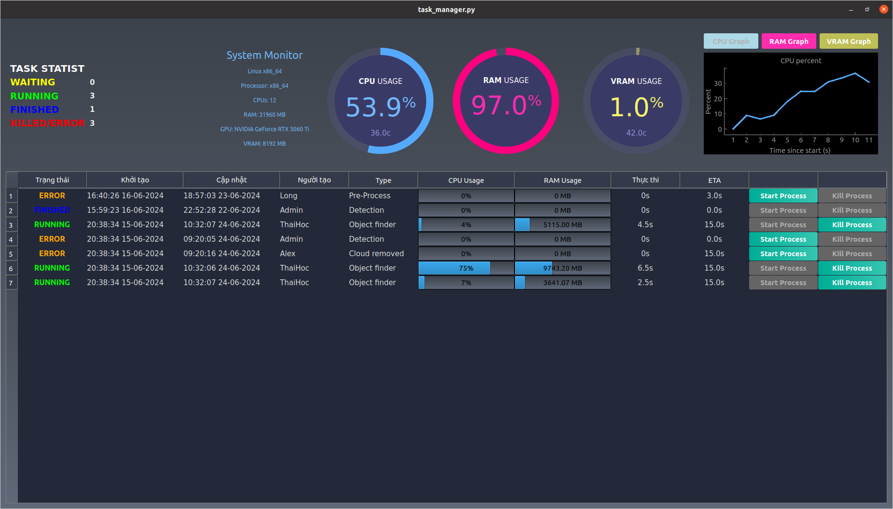

# WTM - Worker Task Manager

## Overview
WTM (Worker Task Manager) is a Python-based system designed to manage and monitor various system resources and tasks. Main features:
- Monitor worker machine CPU, RAM, and GPU usage. 
- Manages tasks from a AVT database, allowing for the display of task lists, automatic task starting, monitoring of running tasks, and handling of unresponsive tasks. Task information is regularly updated in the database.

## Features
- **System Status Monitoring**
  - CPU usage
  - RAM usage
  - GPU usage
  - Network usage (in progress)

- **Task Management**
  - Display list of tasks from the database
  - Automatically start tasks in the queue (needs optimization)
  - Monitor running tasks
  - Kill unresponsive tasks
  - Force kill tasks
  - Update task information to the database


# App UI


## Requirements
- Python 3.x
- Required Python packages (can be installed via `requirements.txt`)

## Installation
1. **Clone the repository:**
   ```bash
   git clone https://github.com/LuThaiHoc/WTM_Worker_Task_Management
   cd WTM_Worker_Task_Management
   ```
2. **Install dependencies:**
    ```bash
   pip install -r requirements.txt
   ```
   If you got error when install psycopg2, need to install libpq first:
   ```bash
   sudo apt-get install libpq-dev
   ```
3. **Configuration**
Setup `config.json` file for database connetion, ftp server and module call command (place it at the same path of main program). 
Simple config file:
    ```json
    {
        "database": {
            "host": "localhost",
            "database": "avtdb",
            "user": "postgres",
            "password": "dbpassword",
            "port": 5443
        },
        "ftp": {
            "host": "localhost",
            "port": 21,
            "user": "username",
            "password": "password"
        },
        "modules":{
            "1" : "modules/01_correction/main",
            "2" : "modules/02_pre_process/main",
            "3" : "modules/03_cloud_remove/main",
            "4" : "modules/04_enhancement/main",
            "5" : "modules/05_detection/main",
            "6" : "modules/06_classification/main",
            "7" : "modules/07_object_finder/main",
            "8" : "modules/08_others/main"
        }
    }
    ```
    Make sure you have modules directory with deploy (one built file) of each module. The WTM will call the module by these module path.
4. **Run the project**
    ```bash
    python task_manager.py
    ```

# Module Development
- When a task needs to be serviced, the Worker Task Manager (WTM) calls a module using correspond command of task type configured in the `config.json` file, passing the task ID as input to the module. Example: `modules/01_correction/main --avt_task_id 12 --config_file config.json`
- The module retrieves task data from the database, processes it, and updates the results back to the database.
- Upon completion, the module exits and returns a code to the WTM: 0 indicates success, while other codes correspond to specific errors defined in [exit_code.py](exit_code.py) (utilizing `sys.exit(code)`).
- For consistency across programs, utilize connection modules for both database operations ([database](utils/database.py)) and FTP connections ([ftp_connector](utils/ftp_connector.py)), located in the `utils` directory.
- For further details, refer to the [Template Matching Module repository](https://github.com/LuThaiHoc/Template_matching_module).


# License
This project is licensed under a private license. Unauthorized copying or distribution of the code, or any part of it, is strictly prohibited.

# Authors
- Thai Hoc - Dev
- SAT project development team